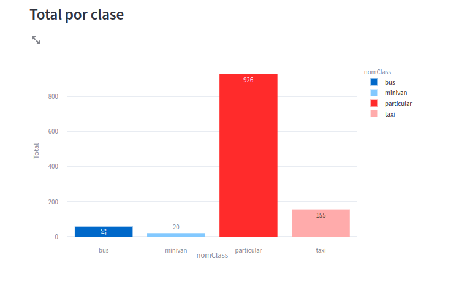

# road-volumes-estimation
Traffic Counting using YOLOv8+DeepSort with Python". Computer vision program to measure volumes of traffic roads.

# Link to the Live App
https://jgomeher83-road-volumes-estimation-app-43g6hy.streamlit.app/

 

https://www.youtube.com/watch?v=Oc06LfKyNyA&t=323s&ab_channel=VintageArtTV
